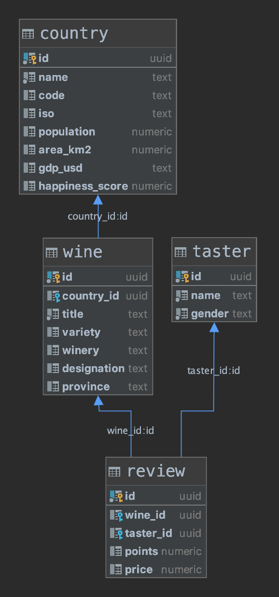

# Wine Review

This project contains a set of relational tables:
* **country**: contains information about 240 countries. 
* **wine**: contains descriptive data per wine. 
* **taster**: contains information about 20 recognized wine tasters. 
* **review**: contains a set of wine reviews. 



## Instructions

1. Create a branch named `wine`. Upload your solution there when finished. 
1. Complete the `analysis.sql` file with the correct sql-code for each data-request. 
1. You can answer this exercise with your project team BUT everyone should upload the results to their github branch. 

For more info about the SQL syntax and functions read the [official postgresql documentation](https://www.postgresql.org/docs/11/index.html). 

## Setup

### Remote

There's a remote database running in google cloud. Access keys will be provided by email. 

### Local setup 

You can also configure your own database by using docker. 

Install docker & docker-compose and run the setup script:

```commandline
$ bash setup.sh
```

Start and configure the services: 

* Start services: `docker-compose up -d`
* Create the tables: `psql $WINE_DATABASE_LOCAL_URL -f setup.sql`
* Load data: `psql $WINE_DATABASE_LOCAL_URL -f load.sql`

## Reference

This data is adapted from the following sources: 

* [Wine reviews](https://www.kaggle.com/zynicide/wine-reviews)
* [World Happiness](https://www.kaggle.com/unsdsn/world-happiness)
* [Country Code Info](https://countrycode.org/)
